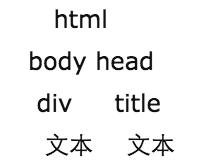

# JS DOM操作入门
### 1. 什么是DOM
 什么叫DOM，DOM是文档对象模型(Document Object Model，是基于浏览器编程（在本教程中，可以说就是DHTML编程）的一套API接口，W3C出台的推荐标准，每个浏览器都有一些细微的差别，其中以Mozilla的浏览器最与标准接近。单纯的Javascript要结合DOM才能做DHTML编程，才能做出漂亮的效果、应用于WEB。这点几乎与其它的语言无异，正如C/C++需要库支持是一样的道理。否则就是单纯的在语法上做研究了。

因此，必须要对DOM有一定的认识，才能把Javascript应用于WEB，或你的RIA应用当中，因为DHTML本质上就是操作DOM树。

    

### 2. DOM树
要注意：DOM树的根统一为文档根—document，DOM既然是树状结构，那么他们自然有如下的几种关系:

1. 根结点(document)
2. 父结点(parentNode)
3. 子结点(childNodes)
4. 兄弟结点 兄弟结点
      (sibling) (sibling)

例子：
假设网页的HTML如下
程序代码

    <html>
     <head>
       <title>never-online's website</title>
     </head>
     <body>
        
tutorial of DHTML and javascript programming

     </body>
    </html>

我们参照树的概念，画出该HTML文档结构的DOM树:

从上面的图示可以看出

1. html有两个子结点，而html就是这两个子节点的父结点
2. head有节点title，title下有一个文本节点
3. body下有节点div，div下有一个文本节点

### 3. 操作DOM树
开篇已经说过，DHTML本质就是操作DOM树。如何操作它呢？

假设我要改变上面HTML文档中div结点的文本，如何做?

程序代码

    <html>
    <head>
    <title>never-online's website</title>
    
    </head>
    <body>
    
tutorial of DHTML and javascript programming

     <input onclick="changedivText('change?')" type="button" value="change"/>
    </body>
    </html>

从上面的示例可以看出，我们可以用上面的这种方法操作DOM树上的任一节点。

注：

1. 跨域除外，跨域通常是在操作frame上，简单的说，就是两个frame不属于同一域名。
2. 上面的操作为了演示，采用的方法是从根结点一直到文本结点的遍历，在DOM方法上，有更简洁的方法，这些以后会有更多示例加以说明，下文中也会有介绍

### 4. DOM节点
细心些的朋友也许发现了，在上面写的HTML代码时用`<>`与`</>`包函起来的就是一个结点，事实上是这样的吗？答案是否定的。下面就是说说节点类型，否则在有的时候是会犯错误的。比如，你把上面的代码放到Mozilla firefox的浏览器里运行一下，就会知道了。

DOM中的结点类型比较多，这里写一些在HTML文档中（注：XML也是DOM树结构）常见的几种结点类型。

1. DOCUMENT_NODE
（document）文档根结点类型，该枚举型的值是9.
2. ELEMENT_NODE
（element）元素结点类型，该枚举型的值是1。上文中的html, body, div这些结点都是属于该类型。
3. TEXT_NODE
（text）文本结点类型，该枚举型的值是3。上文中的文本，如：tutorial of DHTML and javascript programming就是属于该类型。
（注：一个空格也就可能是一个文本结点）

通常更需要注意的是文本结点，有可能一个回车，一个空格都是文本结点。这一点以后会碰到，当然，我们也有办法处理，这里先不要急，以后也会说到的。

### 5. DOM常用的API
这些常用的API是要记下来的，当然在非IE的浏览器里也会有效，是符合w3c的。这些API在以后的编程中会常常用到。正如每个编程平台所提供的API一样，常用必须记下来，节省时间从而提高编程效率。只写几个最常用的，其它的API会在以后的示例中写出。由浅而深，从易到难嘛。

1. 获取ELEMENT_NODE，元素节点
	+ 方法：document.getElementById(元素的Id)，返回值为元素的节点引用。可以假想一下这个API的原理：象我们上面所做的是遍历每个节点（从根到我们所需结点），这个API，也可以想成是从根遍历，查询每个结点（空白结点和空结点除外），并获取该结点的id是否为指定的ID，如果是的话，就返回这个结点（注：在JS中，数组和对象是引用类型），如果没有就返回空。我们可以写写这个代码，帮助我们理解document.getElementById。下面是一个简单遍历BODY中元素的示例。

          <html>
           <head>
           <title>never-online's website</title>
             
          </head>
          <body>
          

          
tutorial of DHTML and javascript programming

          <input onclick="TestGetElementById('textNode')" type="button" value="change"/>
          </body>
          </html>

	+ 属性：object.innerHTML，返回值：一个节点内的HTML值。该属性为可写属性。它虽然不是获取结点，但经常与获取结点相结合，所以我把它放在获取结点这一类，它的属性就类似于是纯文本节点属性中的data。
以document.getElementById和object.innerHTML这两个API为例，我们就可以把上面所写的代码简化一下了，示例如下：

          <html>
          <head>
          <title>never-online's website</title>
          
          </head>
          <body>
          
tutorial of DHTML and javascript programming

          <input onclick="changedivText('change?')" type="button" value="change"/>
          </body>
          </html>

	+ 方法：object.getElementsByTagName(标签的名字)，返回一个集合，该集合的把有元素都是有指定标签的元素。访问集合里的元素，可以用下标来访问。语法里的object，是指document（根）或者是一个ELEMENT_NODE。这个的原理示例我就不写了，可以作为一个作业，大家可以写写。这里写一些具体应用。如上例，我们还可以这样写。

          <html>
          <head>
          <title>never-online's website</title>
          
          </head>
          <body>
          
tutorial of DHTML and javascript programming

          <input onclick="changedivText('change?')" type="button" value="change"/>
          </body>
          </html>

再取一个例子，注意，BODY下的结点深度为2。

    <html>
    <head>
    <title>never-online's website</title>
    
    </head>
    <body>
      

       
tutorial of DHTML and javascript programming

        <input onclick="changedivText('change?')" type="button" value="change"/>
      

    </body>
    </html>

2. 动态创建与插入结点

	+ 创建结点对象。document.createElement(tagname)，tagname指的是一个标签，比如一个DIV，就是document.createElement("DIV")，它返回的是这个结点的引用。
	+ 在body的尾部插入结点用document.body.appendChild(object)，为了容易理解，下面这个示例，我用了IE专有的属性object.outerHTML，得到一个该元素的HTML标签内容（包括自身），这样会更容易看到效果。

            <html>
          <head>
          <title>never-online's website</title>
          
          </head>
          <body>
           
tutorial of DHTML and javascript programming

           <input onclick="insertNode('change?')" type="button" value="change"/>
          </body>
          </html>

	+ 在元素处插入结点。object.insertBefore(oNewNode [, oChildNode])，oNewNode为一个我们创建的结点，oChildNode是可选的，为 object下的一个子节点。同样的，为了看到效果，我也用了outerHTML。示例

          <html>
          <head>
          <title>never-online's website</title>
          
          </head>
          <body>
          
tutorial of DHTML and javascript programming

          <input onclick="insertNode('change?')" type="button" value="change"/>
          </body>
          </html>

3. 移除结点
	+ object.parentNode.removeChild(oChildNode)，这个就是语法，下面看示例。

          <html>
          <head>
          <title>never-online's website</title>
          
          </head>
          <body>
          
tutorial of DHTML and javascript programming

          <input onclick="insertNode('change?')" type="button" value="insert"/>
          <input onclick="removeCreateNode()" type="button" value="remove"/>
          </body>
          </html>

parentNode和parentElement功能一样，childNodes和children功能一样。但是parentNode和childNodes是符合W3C标准的，可以说比较通用。而另外两个只是IE支持，不是标准，Firefox就不支持
