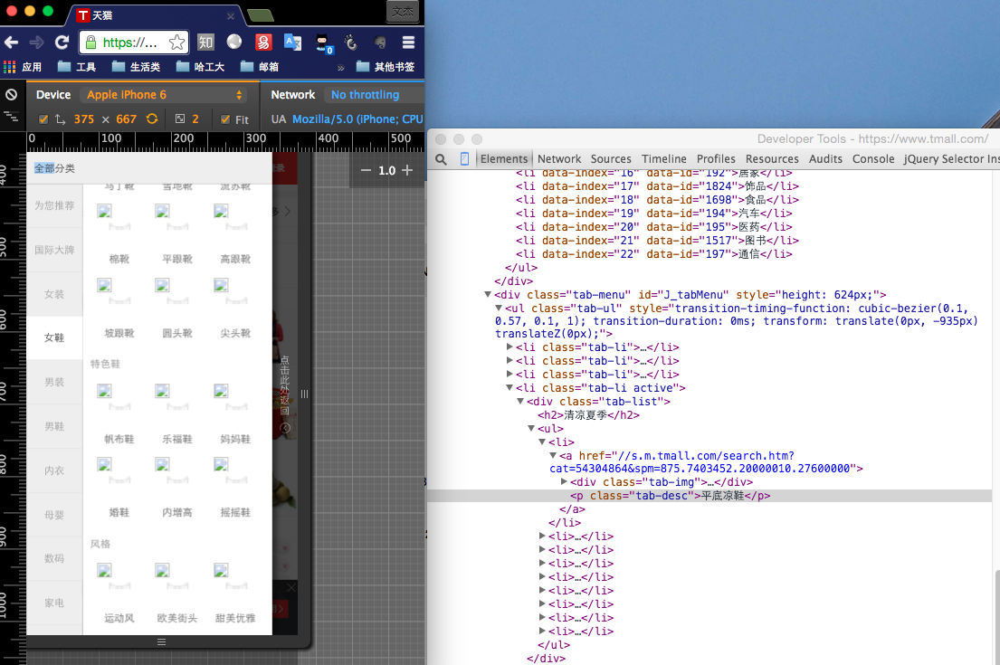

# 移动端适应与小技巧
### viewpointer
使用viewpoint属性，device-width就是浏览器的clientwidth，非物理宽度，对其在移动端做一些缩放或者防止扩充等工作可以提高在移动端的可使用性
具体可以见这[viewpoint和他的朋友们](#viewpoint)这篇博文

### dns-prefetch dns预加载技术（谨慎）
在网页体验中我们常会遇到这种情况，即在调用百度联盟、谷歌联盟以及当前网页所在域名外的域名文件时会遇到请求延时非常严重的情况。那么有没有方法去解决这种请求严重延时的现象呢？

一般来说这种延时的原因不会是对方网站带宽或者负载的原因，那么到底是什么导致了这种情况呢。湛蓝试着进行推测，假设是DNS的问题，因为DNS解析速度很可能是造成资源延时的最大原因。于是湛蓝在页面header中添加了以下代码（用以DNS预解析）：

    <meta http-equiv="x-dns-prefetch-control" content="on" />
    <link rel="dns-prefetch" href="http://bdimg.share.baidu.com" />
    <link rel="dns-prefetch" href="http://nsclick.baidu.com" />
    <link rel="dns-prefetch" href="http://hm.baidu.com" />
    <link rel="dns-prefetch" href="http://eiv.baidu.com" />

效果很不错（测试浏览器为IE8），再打开其他页面时百度分享按钮的加载明显提高！

浏览器对网站第一次的域名DNS解析查找流程依次为：
> 浏览器缓存-系统缓存-路由器缓存-ISP DNS缓存-递归搜索

将页面即将要用的但不属于本页面的链接内容在**整个页面加载完后**再缓存下来，增加下次下次用的这些链接时的反应速度
> 注:
> + dns-prefetch需慎用，多页面重复dns预解析会增加重复dns查询次数
> + 作用是缓存域名与ip的绑定，将内容逐级向内存，增加访问速度

DNS Prefetch 已经被下面的浏览器支持

+ Firefox: 3.5+
+ Chrome: Supported
+ Safari 5+
+ Opera: Unknown
+ IE: 9 (called “Pre-resolution” on blogs.msdn.com)

### apple-mobile-web-app

    <meta name="apple-mobile-web-app-title" content="nihao" />
    //名字
    <meta name="apple-mobile-web-app-capable" content="yes" />
    //iPhone私有标签，它表示：允许全屏模式浏览
    <meta name="apple-mobile-web-app-status-bar-style" content="black" />
    //iPhone私有标签，它指定的iPhone中safari顶端的状态条的样式
    <meta name="format-detection" content="telephone=no; email=no" />
    //不识别邮件和不把数字识别为电话号码

iphone下的api可以支持将页面放到桌面，如nativeapp一样的处理

### App icon 制作
说明：所谓单机模式，其实就是通过把网站添加到主屏，由主屏进入并访问网站的一种方式。通常，app icon是自动截取网站的一部分截图。这样并不是很美观，但也可以通过代码来解决这个问题。尺寸：在iPhone上的默认大小是57px，在iPad上是72px。icon原始图片建议尺寸为128px或者256，并且不建议自行添加光影效果，因为OS自带了。

    <link rel="apple-touch-icon" href="/path/to/custom-icon.png">// 若想去掉系统自带的反光效果，可以增加“-precompsed”属性。
    <link rel="apple-touch-icon-precompsed" href="/path/to/custom-icon.png">

### CSS3 -webkit
移动端表单类有圆角、阴影，点击链接时，有灰色底高亮等

1. 消除被点击元素的外观变化，所谓的点击后高亮：   -webkit-tap-highlight-color: rgba(255, 255, 255, 0);
2. 阻止旋转屏幕时自动调整字体大小：-webkit-text-size-adjust:none;
3. 解决字体在移动端比例缩小后出现锯齿的问题：-webkit-font-smoothing: antialiased;
4. 盒子阴影：-webkit-box-shadow: none;(阴影非常消耗性能)
5. 圆角：-webkit-border-radius: 0;
6. appearance 属性使元素看上去像标准的用户界面元素，    也可以取消默认的样式：-webkit-appearance: none;一般情况下这个属性我们只给按钮元素，解决ios中默认样式使得我们自己写的样式不生效的问题。
7. 栅格布局：box-sizing:border-box;可以改变盒子模型的计算方式方便你设置宽进行自适应流式布局
8. 鼠标可以悬停在内容上（指向该内容）而不激活它（单击它）：-webkit-touch-action: manipulation;

### 解决触屏设备点击延时问题
当触发"Click"事件时，移动端浏览器将等待约300毫秒的时间后再做出响应，原因是浏览器要判断用户是否执行双击。
解决方法，导入 [fastclick.js](http://ftlabs.github.io/fastclick/) 即可减少这个时间差：

    

导入文件后执行 FastClick.attach(dom元素);就可以了
jQuery 使用方法：

    $(function() {
            FastClick.attach(document.body);
    });

### 滚动
在移动端设备上，只支持一个层的滚动，调用系统级的滚动是性能最好的，然而，很多时候需要用到多个层的页面，如天猫
采用translate来模仿滚动事件
监听touchmove事件，然后用translate方法移动相应的距离
